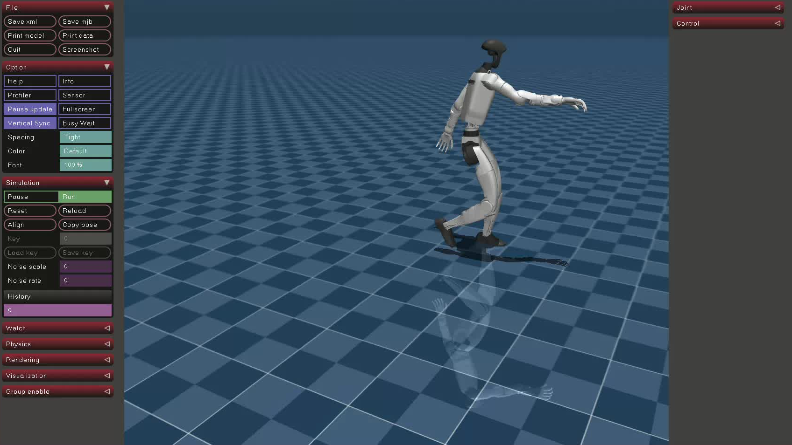

# BeyondMimic Motion Tracking docker 部署环境

# 🌟 该环境为部署环境(后续更新训练环境配置)

🔥 执行脚本 legged_control_init.sh 一键配置 docker 环境，执行完成后会有`sim2real`和`sim2sim`两个文件，通过执行`sim2sim`可以测试是否配置成功。成功后出现**mujoco**里机器人在跳舞

## 可能会出现的问题

- 在安装 docker 过程中会出现脚本退出，**第一次**脚本退出为配置`docker`权限需要重启电脑后再运行脚本，**第二次**脚本退出为`docker`环境配置完成，需要手动进入`docker`环境后在执行脚本。

- 在程序运行到**第 8 步**之后脚本大概率会报错，由于网络原因导致源的添加失败，请重试几次或者更换网络，由于源更新较慢，**请耐心等待！！！！！！！！！！**

- 在执行到**第九步**的时候有可能卡在`[working-]`的安装包的过程中，退出重新执行即可。

##
